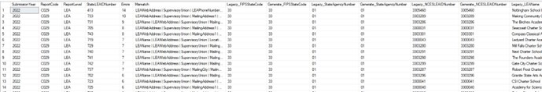

# File Comparison

## Overview

The instructions below explain how to compare a legacy EdFacts submission file to the same file produced by Generate. Note that the C029 comparison uses a different process (see subsequent pages in this document). All procedures used in this process are in the **Generate.Utilities** schema.



### Example Script


```sql
use Generate
exec Utilities.RunSubmissionFileComparison
@DatabaseName = 'Generate', -- If NULL then DatabaseName = 'Generate' 
@SchemaName = 'XX',
@SubmissionYear= 2022, 
@ReportCode = 'C005', 
@ReportLevel = 'LEA',
@LegacySourceFilePathAndName = 'D:\Directory\2022 Legacy Files\Legacy_LEAAssessment1.TAB', 
@GenerateSourceFilePathAndName = 'D:\Directory\2022 Generate Files\Generate_LEAAssessment1.TAB', @FileType = NULL, --'CSV', -- If NULL or 'TAB' then TAB
@ShowSQL = 0
select * from Generate.XX.C005_LEA_2022_COMPARISON
```


### Parameters

* **@DatabaseName** – the name of the database where the tables will be created. If this is NULL then “Generate” will be used&#x20;
* **@SchemaName** – the name of the schema where the tables will be created. The schema must already exist. A suggested schema name may be the state’s 2 character code.
* **@SubmissionYear** – the 4 character submission year for the reports
* **@ReportCode** – the EdFacts report code as defined in the Generate metadata. Example: C029, C039, C002, etc.&#x20;
* **@ReportLevel** – the Report Level as defined in the Generate metadata. Example: “SEA”, “LEA”, “SCH”&#x20;
* **@LegacySourceFilePathAndName** – the fully qualified path and file name to the legacy EdFacts submission file&#x20;
* **@GenerateSourceFilePathAndName** – the fully qualified path and file name to the Generate EdFacts submission file&#x20;
* **@FileType** – “CSV” or “TAB”. If NULL then “TAB” is the default
* **@ShowSQL** – setting this to 1 will show the underlying SQL that is created and executed, but will NOT execute the SQL

## Compare C029 Data

The instructions below explain how to compare a legacy C029 Directory file to C029 Directory data created by Generate.

All procedures used in this process are located in the `Generate.Utilities` schema.



<figure><figcaption></figcaption></figure>

### Notes

* The “Errors” column is a count of columns that have mismatched data. If the “Errors” value = 0 then all columns match
* If the “Errors” value = -1 then the record is missing in one of the files
* Each time you run the comparison the results in this table are replaced. If you want to keep a history of the findings to review, you’ll need to copy the results into another table.


### Demonstration


File Comparison Demo from the Generate 5.3 Office Hour meeting.

