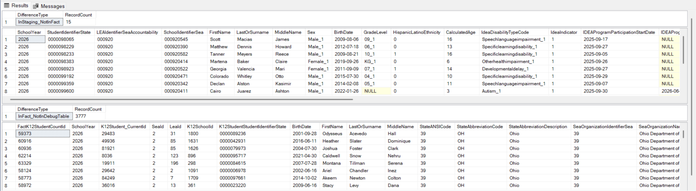

# Utilities.CompareRecordsAcrossMigrations

### Overview

Use `Utilities.CompareRecordsAcrossMigrations` after a successful migration. It compares counts across Staging, Fact, and the relevant debug table.

The utility uses Fact Type debug views for Staging and Fact data. It also uses migration-created debug tables.


This utility supports Student and Staff files only. It does not support Organization files.


### Parameters

| Parameter          | Description                                                          |
| ------------------ | -------------------------------------------------------------------- |
| `@reportCode`      | Three-digit EDFacts report number, such as `002`, `009`, or `118`.   |
| `@reportLevel`     | Three-character report level: `SEA`, `LEA`, or `SCH`.                |
| `@schoolYear`      | Four-digit school year.                                              |
| `@categorySetCode` | Three-character category set, such as `CSA`, `CSB`, `ST1`, or `TOT`. |
| `@stagingFilter`   | Optional criteria that further qualifies results.                    |
| `@showSql`         | Runs the SQL or displays the generated SQL.                          |

#### Defaults and validation

Only `@reportCode` is required. If it is missing or invalid, the stored procedure stops and returns.

* `@reportLevel` defaults to the highest reportable level for the file specification.
* `@schoolYear` defaults to the school year from the last successful migration.
* `@categorySetCode` defaults to the first reportable category set.

#### Filter criteria

Use `@stagingFilter` to further qualify results. Filters use columns from the relevant Fact Type Staging debug view, such as `debug.vwChildCount_StagingTables`.


`@stagingFilter` is a single-quoted string. Escape quoted values with two single quotes. Separate multiple criteria with `and`.


Examples: `'LeaIdentifierSeaAccountability = ''123'' and SchoolIdentifierSea = ''456'' '` and `'IdeaIndicator = 1 '`.

### Execute the procedure

Use Child Count file `002` as an example:


```sql
exec [Utilities].[CompareRecordsAcrossMigrations] '002', 'sea', 2026, 'csa', NULL, 0

exec [Utilities].[CompareRecordsAcrossMigrations] '002', 'lea', 2026, 'csd', 'LeaIdentifierSeaAccountability = ''123'' ', 0

exec [Utilities].[CompareRecordsAcrossMigrations] '002', 'sch', 2026, 'st3', 'IdeaIndicator = 1 and IdeaDisabilityTypeCode = ''AUT'' ', 0
```


### How the utility compares records



#### Validate inputs

The procedure validates parameters and applies defaults where needed.



#### Identify the Fact Type

The supplied report code identifies the associated Fact Type. For example, report code `002` returns `ChildCount`.



#### Load Staging and Fact records

The procedure stores Staging debug-view records in a temporary table. For Child Count, it uses `debug.vwChildCount_StagingTables` and `#staging_records`.

It stores Fact debug-view records in another temporary table. For Child Count, it uses `debug.vwChildCount_FactTable` and `#fact_records`.



#### Load report debug records

The procedure stores matching report debug records in a temporary table. It uses the report code, level, school year, and category set. For example: `debug.002_sea_CSA_2026_DISABCATIDEA_RACEETHNIC_SEX` is stored in `#debug_records`.



#### Return unmatched records

The procedure returns students in Staging but not Fact. It then returns students in Fact but not the report debug table.



### Review results

The results appear in SQL Server Management Studio (SSMS).

<figure><figcaption><p>Example comparison results in SQL Server Management Studio.</p></figcaption></figure>
