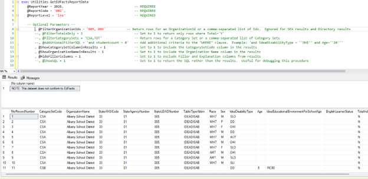

# GetEdFactsReportData Utility

Use `GetEdFactsReportData` to return Generate report data in the EDFacts file layout. The utility adds column headings and, when appropriate, a formatted header record.

This supports data review and file production when the Generate user interface is unavailable. SEA data owners with database access can review data before submitting it to the Department of Education.


Run this stored procedure from SQL Server Management Studio against the Generate database.


### Run the utility

The stored procedure is in the `Utilities` schema. It requires three parameters and accepts additional optional parameters.


```sql
exec Utilities.GetEdFactsReportData 
	@ReportYear = 2026,			-- REQUIRED
	@ReportCode = '002',		-- REQUIRED
	@ReportLevel = 'lea'		-- REQUIRED

-- Optional Parameters --
	--, @FilterOrganizationIds = '005, 009' 
	--, @FilterTotalsOnly = 1
	--, @FilterCategorySets = 'CSA,TOT'
	--, @AdditionalFilterSQL = 'and studentcount = 0'
	--, @ShowCategorySetColumnInResults = 1	
	--, @ShowOrganizationNameInResults = 1
	--, @HideFillerColumns = 1	
	--, @ShowSQL = 1
```


### Required parameters

Provide each required parameter when running the utility.

| Parameter      | Description                                                      | Example |
| -------------- | ---------------------------------------------------------------- | ------- |
| `@ReportYear`  | Report year to query.                                            | `2026`  |
| `@ReportCode`  | Report code to query.                                            | `'002'` |
| `@ReportLevel` | Report level to query. Valid values are `SEA`, `LEA`, and `SCH`. | `'lea'` |

#### Results with required parameters


If parameters are invalid, or no matching data exists, the utility returns:\
`Invalid Parameters or no data exists for the combined parameters.`


When valid parameters return data, the utility produces two result sets:

1. Records from the matching report table. These follow the EDFacts file specification. They include `FileRecordNumber` and applicable filler columns.
2. A header record that follows the EDFacts file specification. Its `FileName` and `FileIdentifier` include the state abbreviation from `RDS.ReportEdFactsOrganizationCounts` directory data.

You can save the data to a file. You can also copy the header and data into a document. This produces a submission file that should pass EdPass format validations.

#### Example: 2026 LEA report 002

<figure><figcaption><p>Example GetEdFactsReportData output for 2026 LEA report 002.</p></figcaption></figure>

***

### Optional parameters

Use optional parameters to filter results or change the returned columns.

| Parameter                         | Description                                                                                                                            |
| --------------------------------- | -------------------------------------------------------------------------------------------------------------------------------------- |
| `@FilterOrganizationIds`          | Returns rows for one organization ID or a comma-separated list. Ignored for SEA and Directory results.                                 |
| `@FilterTotalsOnly`               | Set to `1` to return only rows where `Total='Y'`.                                                                                      |
| `@FilterCategorySets`             | Returns rows for one category set or a comma-separated list.                                                                           |
| `@AdditionalFilterSQL`            | Adds criteria to the `WHERE` clause. Example: `'and IdeaDisabilityType = ''OHI'' and Age=''20'''`. Use doubled quotes for dynamic SQL. |
| `@ShowCategorySetColumnInResults` | Set to `1` to include `CategorySetCode`.                                                                                               |
| `@ShowOrganizationNameInResults`  | Set to `1` to include the organization name.                                                                                           |
| `@HideFillerColumns`              | Set to `1` to exclude Filler and Explanation columns.                                                                                  |
| `@ShowSQL`                        | Set to `1` to return SQL instead of results. Use this for debugging or more complex SQL.                                               |

#### Results with optional parameters


If parameters are invalid, or no matching data exists, the utility returns:\
`Invalid Parameters or no data exists for the combined parameters.`


When valid parameters return data, the utility produces two result sets:

1.  A message confirming that the dataset no longer conforms to the EDFacts file specification:

    <div data-gb-custom-block data-tag="hint" data-style="danger" class="hint hint-danger"><p><code>NOTE: This dataset does not conform to EdFacts file specifications and cannot be uploaded to EdPass</code></p></div>
2. Filtered report-table records. The selected parameters control the returned rows and columns.

#### Example: filtered output

This example uses several optional parameters:

* `@FilterOrganizationIds` includes only two LEAs.
* `@ShowCategorySetColumnInResults` and `@ShowOrganizationNameInResults` are set to `1`.
* `@HideFillerColumns` is set to `1` to remove blank filler columns.

<figure><figcaption><p>Example GetEdFactsReportData output with optional filters and display settings.</p></figcaption></figure>
