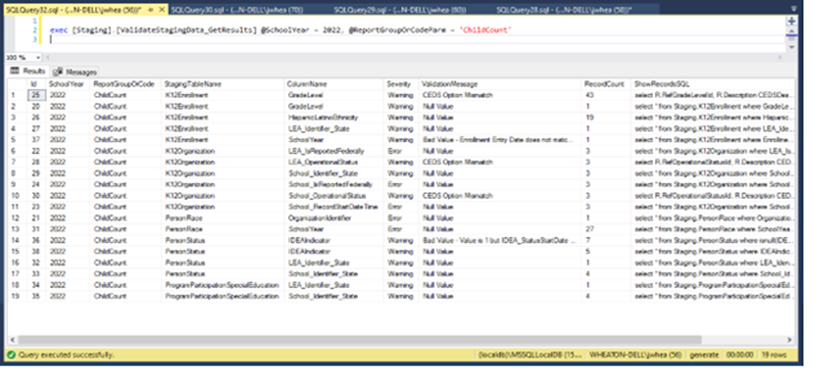

# Staging Validation (Old Process)

## **Generate Staging Validation Process**

Generate 5.2 includes a new Staging Validation process to allow states to apply validation rules to the staging data prior to continuing the migration process through Generate.

Generate 5.2 is preconfigured with validation rules designed mostly for Directory and Child Count. Additional rules will be added in future releases.

### Staging Validation Overview

The staging validation process is comprised of four components (two tables and two stored procedures) as shown in Figure 1 below.

.png>)


#### Staging Validation Rules Table

This table contains pre-defined validations. A validation can be configured for a specific table and column, and can be configured for various types of validation checks.

#### Staging Validation Stored Procedure

This stored procedure, when executed, retrieves the list of validations from the rules table and executes each one. If any validation results in a finding, the results are written to the Staging Validation Results table.

#### Staging Validation Results Table

This table contains all validation findings. This table needs to be maintained by the state to save as much/little as desired from each run of the process.

#### View Validation Results Stored Procedure

The Staging Validation Results table can be queried directly, but a procedure is provided to easily return results as well.

### Staging Validation Rules Table

#### Table Name: _`Staging.StagingValidationRules`_

The initial ruleset has four distinct types of validation: No Records, Null Value, Bad Value, Option Not Mapped.

* **No Records** - The entire table did not load
* **Null Value** - A required field loaded with a NULL or missing value
* **Bad Value** - The value for a field did not meet specific criteria
* **Option Not Mapped** – A codeset value wasn’t mapped in SourceSystemReferenceData

.png>)

### Executing the Validation Process

To run the new process manually from SSMS, execute the following SQL statement, including the 2 parameters, @SchoolYear and @ReportGroupOrCodeParm:

exec \[Staging].\[ValidateStagingData] @SchoolYear = 2022, @ReportGroupOrCodeParm = 'ChildCount'

**@SchoolYear** = School Year that matches the data loaded into the staging tables\
&#xNAN;**@ReportGroupOrCodeParm** = The EDFacts report number or GroupName, i.e. ‘C002’ or ‘ChildCount’ which will execute the specific set of rules associated with the report or group.

This will populate the Staging Validation Results table.

### Staging Validation Results Table

#### Table Name: _`Staging.StagingValidationResults`_

To view the results of the staging validation, execute the following SQL statement, including the parameters, @SchoolYear and @ReportGroupOrCodeParm:


```sql
exec [Staging].[ValidateStagingData_GetResults] @SchoolYear = 2022, @ReportGroupOrCodeParm = 'ChildCount'
```


**@SchoolYear** = School Year that matches the data loaded into the staging tables\
&#xNAN;**@ReportGroupOrCodeParm** = The E&#x44;_&#x46;acts_ report number or GroupName, i.e. ‘C002’ or ‘ChildCount’ which will execute the specific set of rules associated with the report or group.


There is in an optional parameter, @IncludeHistory=1, which will include results from all previous Validations for the school year and report group.


Below are the results of running the _**`ValidateStagingData_GetResults`**_ procedure:

<figure><figcaption><p>Results of running the <em><strong><code>ValidateStagingData_GetResults</code></strong></em> procedure</p></figcaption></figure>

The results table includes a column named “**ShowRecordsSQL**”. The contents of this column for particular row can be pasted into a SQL Query window and executed to see a list of records that caused the validation error.

For example, in validation Id 36 above, where 7 records failed validation, executing the **ShowRecordsSQL** would return the following:

.png>)

This shows a list of students in staging that were marked as IDEA but did not have an IDEA Status Start Date or Primary Disability Type value. This is a very useful feature to streamline ETL troubleshooting.

### Integration of Validation into Generate Migration

The Staging Validation process can be integrated into the Generate Migration workflow in a number of ways, depending on your preference.

#### Option 1 – Standalone SQL Server Operation

With this option, once the ETL(s) to ingest source data into staging is completed, the Staging Validation stored procedure could be executed in SSMS to return the validation findings. Query the Staging Validation Results table to review the findings and make appropriate corrections to the data and/or ETL logic and rerun the ETL(s) until no validation errors are found (or until the remaining validation findings are acceptable). Then continue with the migration steps.

#### Option 2 – Automatic as Part of the ETL Process

With this option, the State ETL procedures could include a call to the Staging Validation stored procedure and execute it automatically after completion of the staging data transfer. Query the Staging Validation Results table to review the results using SSMS.

Future releases of Generate plan to include the option of executing and reviewing these results from the User Interface.
