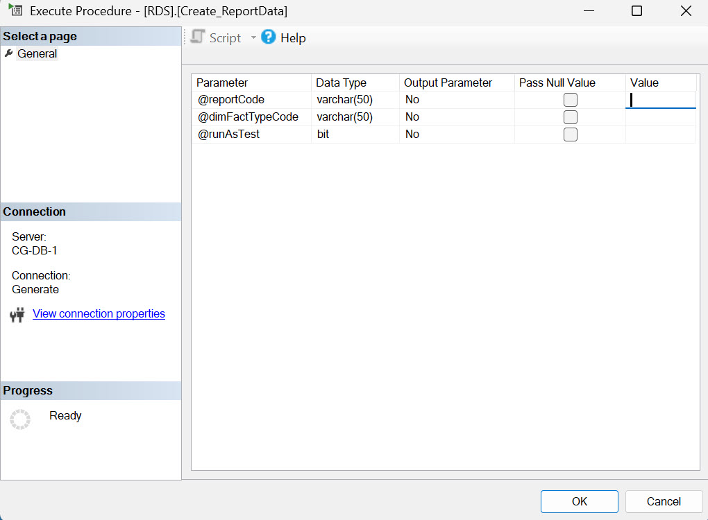

# Troubleshooting Report Migration Results

## Preparing the Data

Once the RDS Fact and Dimension table migrations are complete and you are comfortable with that data, run the report migration.

## File Comparison

The Generate Submission File Comparison Utility (“Comparison Utility”) provides tools to load legacy EDFacts files into SQL tables, then compares the Generate versions of those same files to the legacy file to identify differences. For more information on how to utilize this tool to verify counts, review the [File Comparison](https://app.gitbook.com/o/54A84G98mRVbG3AeyXRJ/s/rRyeWMyPKDUxlv4sroOL/developer-guides/generate-utilities/file-comparison) steps under Generate Utilities.&#x20;

## Validate and Troubleshoot Issues

If you need to validate the data, have run the File Comparison Utility and found unexpected discrepancies, or have reviewed the report and identified issues, follow the steps below to ensure data accuracy and troubleshoot any problems. &#x20;

Open SQL Server Management Studio (SSMS) (or whatever tool you use to do your SQL database work). Then open your Generate database (which may be named differently), expand “Programmability,” then expand “Stored Procedures.”   &#x20;

<figure><figcaption></figcaption></figure>

Scroll down to the stored procedure RDS.Create\_ReportData, right-click on it, then click on ‘**Execute Stored Procedure**.’ (Note: This stored procedure is used for all student-level EDFacts reports. For organization level EDFacts reports, follow the same steps but start with the stored procedure RDS.Create\_OrganizationReportData.

<figure><figcaption></figcaption></figure>

After executing, a dialog box will open with three parameters that need to be populated.


Organization level EDFacts reports will only have two parameters: @reportCode and @RunAsTest. They are also implemented as described below.


<figure><figcaption></figcaption></figure>

**@reportCode**&#x20;

The first parameter is @reportCode. Enter the EDFacts file specification number in the “Value” column (for example, 006).

**@dimFactTypeCode**&#x20;

The second parameter is @dimFactTypeCode. The Generate Fact Type governs the report you are running. Enter the Fact Type in the Value column (for example, following the example used above for the @reportCode value of 006, the corresponding Fact Type would be ‘Discipline’). (Note: If you don’t know the Fact Type, you can find it in the Generate user interface (UI). On the Report Migration screen, there is a select drop-down that shows the Fact Type name followed by all the reports in that Fact Type. You can also query the table “RDS.DimFactTypes” and it will provide the same information.)

**@RunAsTest**&#x20;

The third parameter is @RunAsTest. This is a bit (Y/N) field. Normally, this stored procedure is executed with the parameter set to 0 (No), which means the migration is running normally and will populate the report table as expected. Setting this parameter to 1 (Yes), allows you to get the migration code that ‘would’ be executed normally. &#x20;

Once you’ve entered the appropriate values, click ‘OK.’  The following will display. &#x20;

<figure><figcaption></figcaption></figure>

In the results panel at the bottom of the screen, click on the ‘Messages’ tab.

**Understanding the Results**&#x20;

The information that follows explains what is presented in the ‘Messages’ tab.&#x20;

Generate handles the report population by gathering the metadata for the EDFacts file.  Metadata is used to determine:&#x20;

* What report levels (SEA, LEA, School) are required&#x20;
* What category sets are required&#x20;
* What values are expected in each category set&#x20;

Generate produces a distinct block of code for each combination based on that metadata. For example, SEA CatSet A, SEA CatSet B, SEA ST1, LEA CatSet A, LEA CatSet B, etc. &#x20;

Each block of code will start with something that looks like this:


```
-- 2024 - 1 of 10 / 006-sea-CSA - |DISABCATIDEA|,|DSCPLMETHOD|,|REMOVALLENSUS
```


If you want to see the general logic at the SEA level, go to the first block of code. If you have a specific count that you are investigating, move to that specific block of code. For instance, if you had a discrepancy with the counts by SEX at a specific LEA, then you would scroll down to:

```
-- 2024 - 8 of 10 / 006-lea-CSC - |DSCPLMETHOD|,|REMOVALLENSUS|,|SEX| 
```

Once you have identified the block of code you want to work with, highlight the code from the start of that header row to the beginning of the next header row. Then copy (CTRL-C) the code, open a New Query window (CTRL-N) (or use the ribbon option in SSMS), and paste the code (CTRL-V) into that new window.

**Analyzing the Results**&#x20;

The following section describes one possible approach to using this code to analyze the results of the Generate counts. As you gain experience, you can apply it in whatever way best suits your specific situation.&#x20;

Before you begin, you need to format the block of code as follows. &#x20;


At the bottom of the code block there are two sections that you need to pay attention to before you run the script, the ‘Create Debugging Tables’ section and the ‘insert’ into the appropriate Report table. **If you don’t want to overwrite the data that has been populated during troubleshooting, comment out the insert portion of the code.**



Note: This is the actual code that is used in the report migration so if you don’t comment it out while you’re troubleshooting, you will replace the report totals each time you run it.


<figure><figcaption></figcaption></figure>

Once you have commented out the ‘Create Debugging Tables’ and ‘insert,’ you can manipulate the SQL code as necessary to get the information you need. It will not impact any ‘live’ data, so you can modify it, run parts of it, etc.


**Additional Note:** The blocks of code are created using dynamic SQL which generates the SQL code on the fly. As such, it is not always formatted perfectly so some basic formatting may be required to help you navigate the code, e.g., indenting, dropping long continuous lines of code to new lines, etc. The dynamic SQL builds out multiple temp tables at the top of the script that are used below in the main select statement. Each of those temp tables can also be analyzed to make sure they are returning the expected results.


**Executing the Script**

Next, execute the entire set of code (there is no need to highlight anything) using the _**Execute**_ button in the SSMS ribbon (or by pressing F5). This will create all the temp tables that are referenced in the joins and allow you to use the code in a way that best suits your needs. Examples of these temp tables are: #cat\_RACE and #cat\_SEX. These temp tables are joined with other tables to get the data for the #categoryset temp table. &#x20;


**The following information is a breakdown of what these blocks of code look like:**&#x20;


**Declaration Block**&#x20;

The very top of the code will have the variable declaration.
\
declare @dimSchoolYearId as int
\
declare @dimFactTypeId as int
\
set @dimSchoolYearId = 25
\
set @dimFactTypeId = 24

**Metadata Block**

The next section of the code may vary slightly depending on the file specification, but the sections are all generally the same. (Note: There are a few files for which a temp table is created to capture students or organizations that will be used in the joins below the temp tables.)&#x20;

All the code, regardless of the file specification, will then query the metadata to get the appropriate values for the category set that was selected. There will be a block of code (like the example below) that retrieves all the data and moves that data into temp tables to be used in the joins.

<figure><figcaption></figcaption></figure>

**Select Block**&#x20;

The next block is where the students are accumulated into a temp table called #categorySet. This is the block of code that will apply the file specification logic and rules. The required data are selected into the temp table. &#x20;

There are two parts of the query to be aware of when it is used to investigate the count results: (1) #categorySet, and (2) the inner join within #categorySet, labeled ‘rules.’&#x20;

Rules Block

A good place to start is the inner join to a subquery aliased as ‘rules.’


**Note:** Some files may create a temp table at the top of the code named #RULES. That table replaces what we are about to describe next, but you can troubleshoot it in the same way.


<figure><figcaption></figcaption></figure>

This query isolates the students that are going to be included from the Fact table and also applies the exclusionary logic required by the file specification. If you want to execute this block to evaluate the set of students it returns, you will first need to manually set the two variables ‘@dimSchoolYearId’ and ‘@dimFactTypeId.’ The values needed are at the very top of the code that was pasted in. Just replace the variable name with the appropriate number, highlight the block of code, and execute it. In this example, you would replace @dimSchoolYearId with ‘25’ and @dimFactTypeId with ‘24.’&#x20;


**Note:** The code for this file uses \[K12StudentStudentIdentifierState] in the select query. This is the state Student ID. Some of the other files use \[K12StudentId] which is the row ID from the rds.DimPeople table. If this is the case, each of these ‘rules’ queries will need to join to the table rds.DimPeople. If you add \[K12StudentStudentIdentifierState] from rds.DimPeople to the select, you’ll see the Student ID that you’re expecting from your state data.&#x20;


You can manipulate the query depending on what you are looking for. For example, you can add more data to the select (as long as it comes from one of the joined tables) or you can add conditions to the ‘where’ clause to narrow down the results. For example, using the code above for file 006, you could add conditions like:&#x20;

```
--Look for a specific student 
	and rdp.K12StudentStudentIdentifierState = '123456789' 
--Look for all students in a specific school 
	and s.SchoolIdentifierSea = '1234' 
--Look for all students in a specific Lea 
	and org.LeaIdentifierSea = '123' 
--Look for only students with an In-School suspension 
	and rdds.DisciplineMethodOfChildrenWithDisabilitiesCode = 'InSchool' 
```


**Note:** If the records you expected to see aren’t included or are incorrect, verify that all the temp tables in the script have the appropriate results and are not empty. If they all look correct, then go back to the RDS migration step to determine why you are seeing those results in the Fact table. In this example you would look at Staging.Staging-to-FactK12StudentCounts\_ChildCount.


**#categorySet Block**

If the results of the ‘rules’ query are reasonable, the next step is to run the entire block and see what is loaded into the #categorySet temp table. For this, find the following comment in the code:

```
-- Remove Missing Counts 
```

Comment out everything below the **remove missing counts** and add this line and run the code.

select \* from #categorySet

Then highlight from that select to the top of the code and execute it. This runs the full set of logic and identifies what is loaded into that temp table. You can then add conditions to that query to drill into the results as needed. (Note: the conditions you add to this select are going to vary by file specification and by category set within a file specification. That’s why it’s best to run the full query first so you can see what columns are included and what their values look like. Then you will know how to modify the query.)

**Remove Missing Counts Block**&#x20;

The next block that starts with&#x20;

```
-- Remove Missing Counts 
```

simply removes the permitted value ‘Missing’ if there are actual values in a given category. In other words, the file specification does not allow reporting both Removal Reason and Missing; it must be one or the other.

**Create Debugging Tables Block**

The next block that starts with&#x20;

```
-- Create Debugging Tables 
```

This logic writes the student data to the debug tables. This does not impact which students are counted/not counted. These tables can be used to see what students are included in the aggregate counts. Note: Do not overwrite this while you are exploring the data.

**Select Block**&#x20;

The last part of the code to review is the actual SELECT statement at the bottom. This is the code that does the aggregation. It shows you any joins or group bys, whether the count is distinct or not, and what field is being counted for the aggregation.

<figure><figcaption></figcaption></figure>
