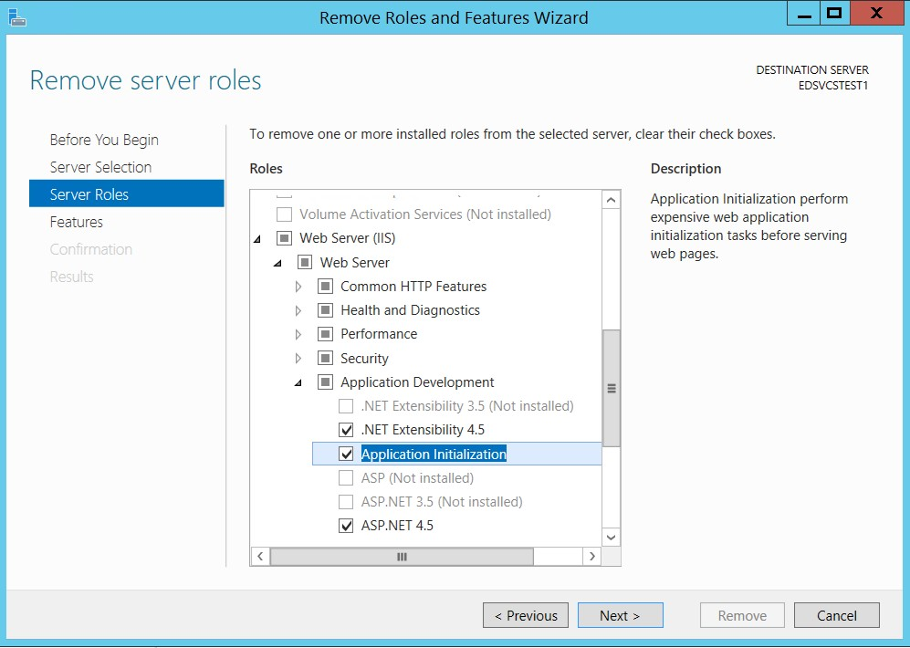
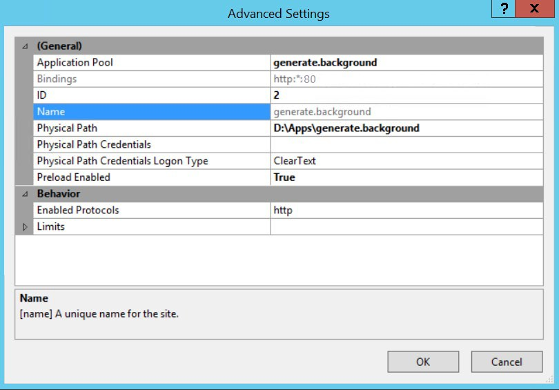
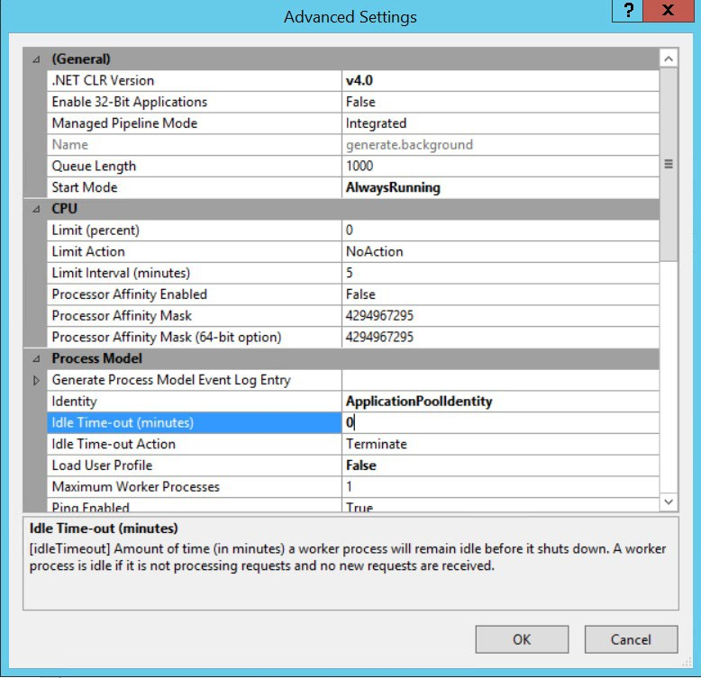
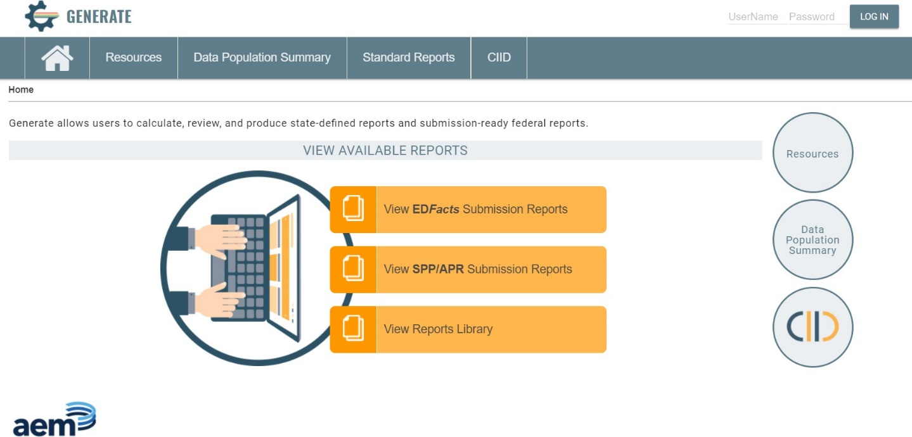

# Installation

## System Requirements

#### Web Server:

* [x] Windows 2012 R2 (or newer) with IIS 8.5 (or newer)
* [x] At least 8 GB of RAM

#### Database Server:

* [x] Windows 2012 R2 (or newer) with SQL Server 2017 (or newer)
* [x] At least 32 GB of RAM (64 GB RAM recommended)
* [x] At least 50 GB of free storage
* [x] Web Server and Database Server may be on the same machine, if desired.
* [x] .NET Core Runtime: Version 8.0.10 installed on Web Server.
* [x] Active Directory (AD) accessible from the Web Server. If no AD installation exists, AD LDS may be installed.
* [x] Application Initialization Module for IIS installed on the Web Server.

## Installation Steps

### Update


If you are on **version 3.1** or later, take advantage of the automatic update feature in Generate. Directions can be found in the [Generate User Guide](../../user-guide/settings/update.md).


### Database Server

1. Create an empty database called “**generate**” in SQL Server.
2. Create a SQL login called “**generate**”.
3. Using the Generate database backup file for this version (generate\_x.x.bak where x.x is the version number), restore to the new empty “generate” database. This backup file was created from SQL Server 2012 R2. If you are using a newer version of SQL Server and encounter difficulty with this restore, a newer version of the backup file can be provided.
4. Please note, the database contained within the backup file is called “generate-test”. Please make sure to restore to the “generate” database just created.
5. Restore “db\_owner” permissions to the “generate” user on the “generate” database.

### Web Server

6. Ensure IIS is installed.
7. Ensure all pending Windows Updates are installed.
8. Install .NET Core Runtime and Hosting Bundle (version 6.0). Installation files can be found here:
   * [https://dotnet.microsoft.com/en-us/download/dotnet/thank-you/runtime-aspnetcore-6.0.11-windows-hosting-bundle-installer](https://dotnet.microsoft.com/en-us/download/dotnet/thank-you/runtime-aspnetcore-6.0.11-windows-hosting-bundle-installer)
   * If the Web Server does not have access to the Internet, install the Microsoft Visual C++ 2015 Redistributable (version 14.0.24212 or newer) prior to the .NET Core Windows Server Hosting bundle.
9. Execute `iisreset` at the command line or restart the server to pick up changes to the system PATH.
10. Install the Application Initialization Module for IIS.

You can find the Application Initialization module via the Server Manager under **Server Roles** -> **Web Server (IIS)** -> **Web Server** -> **Application Development** -> **Application Initialization**.


This is the only item that is required for this installation; any other items This is the only item that is required for this installation; any other items checked in the following screenshot are not necessary and may remain checked or unchecked depending on your environment.&#x20;





The Web Application will need to be accessible independent of the Background Application. You can achieve this by one of the following methods:


* Place both applications on the same server but assign different host names to each website.
* Place both applications on the same server but assign different ports to each website.
* Place both applications on the same server but assign different IP addresses to each website.
* Place the web application and background applications on different servers.

### Web Application

11. Extract the contents of “**generate.web\_x.x.zip**” into a temporary directory.
12. Copy the “**generate.web\_x.x**” folder into a location where you want your web application files to reside.
13. In IIS, create a website called “**generate.web**” and point the physical path to the location of the web application files. Leave the application pool set to a new pool called “**generate.web**”. Adjust the IP Address, Port, and/or Host name as needed for your environment (as mentioned in the Web Server installation steps).

.jpeg>)

14. Set the application pool used by the `generate.web` website to “**No Managed Code**.”

.jpeg>)

15. The application pool used by the Generate website needs to be run under a service account that has access to the Active Directory service. Usually, this account is a domain service account on the network. This can be changed by accessing the Advanced Settings of the newly created application pool.

.jpeg>)

16. From that dialog, change the Identity setting under the Process Model section to the domain service account.

.jpeg>)

17. Make sure that the Application Pool Identity user account has permission to Create and Modify files in the Updates and Logs directories of the website folder.
18. Ensure that **Anonymous Authentication** is "**Enabled"** on the website.

.png>)

19. Open the “**appSettings.json**” file located in the “**Config**” directory of the `generate.web` application folder.


To retain proper formatting, Notepad++ is recommended over Notepad or Wordpad.


20. &#x20;Ensure that the “**AppSettings.Environment**” value is set to “**production**.”
21. Replace the values of the SQL Server Connection String keys with values appropriate for the installed environment.

<pre class="language-json"><code class="lang-json"><strong>{
</strong>“AppSettings”: {
“Environment”: “production”,
“ProvisionJobs”: false,
“ADDomain”: “ETSS.local”,
“ADLoginDomain”: “ETSS”,
“ADPort”: “389”,
“ADContainer”: “CN=Builtin,DC=ETSS,DC=local”,
“UserContainer”: “CN=Users,DC=ETSS,DC=local”,
“ReviewerGroupName”: “CN=Users,CN=Builtin,DC=ETSS,DC=local”,
“AdminGroupName”: “CN=Administrators,CN=Builtin,DC=ETSS,DC=local”,
“BackgroundUrl”: “http://192.168.1.2”,
"BackgroundAppPath": "D:\\Apps\\generate.background"
},
"Data": {
"AppDbContextConnection": "Server=192.168.01.01;Database=generate;User ID=generate;Password=xxxxxxxxxxx;trustServerCertificate=true;MultipleActiveResultSets=true;",
"ODSDbContextConnection": "Server=192.168.01.01;Database=generate;User ID=generate;Password=xxxxxxxxxxx;trustServerCertificate=true;MultipleActiveResultSets=true;",
"RDSDbContextConnection": "Server=192.168.01.01;Database=generate;User ID=generate;Password=xxxxxxxxxxx;trustServerCertificate=true;MultipleActiveResultSets=true;Connect Timeout=300;"
}
}
</code></pre>


The SQL Connection String should be the same for all three connections.


21. If the connection string contains a backslash (\\), it should be escaped with an additional backslash to retain proper JSON syntax.

### Background Application

22. Please ensure that the Application Initialization Module for IIS was installed as part of [step 10](./#web-server-1) of the installation instructions.
23. Extract contents of “**generate.background\_x.x.zip**” into a temporary directory.
24. Copy the “**generate.background\_x.x**” folder into a location where you want your background application files to reside.
25. In IIS, create a website called “**generate.background**” and physical path to the location of the background application files. Leave the application pool set to a new pool called “**generate. background**”. Adjust the IP Address, Port, and/or Host name as needed for your environment (as mentioned in the Web Server installation steps).

.jpeg>)

26. Edit the “**Advanced Settings**” of the **generate.background** website and make sure the following property is set:

> **Preload Enabled** = <mark style="color:blue;">**True**</mark>



27. Edit the “**Advanced Settings**” of the **generate.background** application pool and make sure the following properties are set:

> **.NET CLR Version** = <mark style="color:blue;">**v4.0**</mark>
>
> **Start Mode** = <mark style="color:blue;">**AlwaysRunning**</mark>
>
> **Idle Time-Out (minutes)** = <mark style="color:blue;">**0**</mark>



28. Make sure that the Application Pool Identity user account used by this website has permission to Create and Modify files in the Updates and Logs directories of the application folder.
29. Ensure that **Anonymous Authentication** is "**Enabled"** on the website.
30. Open the “**appSettings.json**” file located in the **generate.background** application folder.


To retain proper formatting, Notepad++ is recommended over Notepad or Wordpad.


31. &#x20;Ensure that the “**AppSettings.Environment**” value is set to “**production**.”
32. Replace the values of the SQL Server Connection String keys with values appropriate for the installed environment.

```sql
{
"AppSettings": {
"Environment": "production",
"WebAppPath": "D:\\Apps\\generate.web"
},
"Data": {
"HangfireConnection": "Server=192.168.1.1;Database=generate;User ID=generate;Password=xxxxxxxxxxx;MultipleActiveResultSets=true;",
"AppDbContextConnection": "Server=192.168.1.1;Database=generate;User ID=generate;Password=xxxxxxxxxxx;MultipleActiveResultSets=true;Connect Timeout=3600;",
"ODSDbContextConnection": "Server=192.168.1.1;Database=generate;User ID=generate;Password=xxxxxxxxxxx;MultipleActiveResultSets=true;Connect Timeout=300;",
"RDSDbContextConnection": "Server=192.168.1.1;Database=generate;User ID=generate;Password=xxxxxxxxxxx;MultipleActiveResultSets=true;Connect Timeout=300;"
}
}
```

The SQL Connection String should be the same for all four connections.

32. If the connection string contains a backslash (\\), it should be escaped with an additional backslash to retain proper JSON syntax.
33. Replace the value of the **WebAppPath** key with a value appropriate for the installed environment. This should be the physical path of the **generate.web** application files (specified in [step 13](./#web-application) of the Web Application installation steps).

```sql
{
"AppSettings": {
"Environment": "production",
"WebAppPath": "D:\\Apps\\generate.web"
},
"Data": {
"HangfireConnection": "Server=192.168.1.1;Database=generate;User ID=generate;Password=xxxxxxxxxxx;MultipleActiveResultSets=true;",
"AppDbContextConnection": "Server=192.168.1.1;Database=generate;User ID=generate;Password=xxxxxxxxxxx;MultipleActiveResultSets=true;Connect Timeout=3600;",
"ODSDbContextConnection": "Server=192.168.1.1;Database=generate;User ID=generate;Password=xxxxxxxxxxx;MultipleActiveResultSets=true;Connect Timeout=300;",
"RDSDbContextConnection": "Server=192.168.1.1;Database=generate;User ID=generate;Password=xxxxxxxxxxx;MultipleActiveResultSets=true;Connect Timeout=300;"
}
}
```

34. Save and Close the “**appSettings.json**” file for **generate.background**.
35. Open the “**appSettings.json**” file located in the “**Config**” directory of the **generate.web** application folder. Replace the value of the **BackgroundUrl** and **BackgroundAppPath** keys with values appropriate for the installed environment. If these keys do not exist in the .json file, please add them.&#x20;
    * **BackgroundUrl** refers to the URL of the **generate.background** application.
    * **BackgroundAppPath** refers to the physical path of the **generate.background** application files (specified in [step 25](./#background-application) of the Background Application installation steps).

```sql
{
"AppSettings": {
"Environment": "production", "ProvisionJobs": false, "ADDomain": "ETSS.local", "ADLoginDomain": "ETSS", "ADPort": "389",
"ADContainer": "CN=Builtin,DC=ETSS,DC=local", "UserContainer": "CN=Users,DC=ETSS,DC=local", "ReviewerGroupName": "CN=Users,CN=Builtin,DC=ETSS,DC=local",
"AdminGroupName": "CN=Administrators,CN=Builtin,DC=ETSS,DC=local", "BackgroundUrl": "http://192.168.1.2",
"BackgroundAppPath": "D:\\Apps\\generate.background"
},
"Data": {
"AppDbContextConnection": "Server=192.168.01.01;Database=generate;User ID=generate;Password=xxxxxxxxxxx;MultipleActiveResultSets=true;",
"ODSDbContextConnection": "Server=192.168.01.01;Database=generate;User ID=generate;Password=xxxxxxxxxxx;MultipleActiveResultSets=true;",
"StagingDbContextConnection": "Server=192.168.1.1;Database=generate;User ID=generate;Password=xxxxxxxxxxx;trustServerCertificate=true;MultipleActiveResultSets=true;",
RDSDbContextConnection": "Server=192.168.01.01;Database=generate;User ID=generate;Password=xxxxxxxxxxx;MultipleActiveResultSets=true;Connect Timeout=300;"
}
}
```

### Permission Changes

For the Auto-Update functionality of Generate to work properly, you must ensure that the following permissions are set on the **generate.web** and **generate.backgound** directories:

* The Application Pool Identity user account used by the **generate.background** site, must have Create and Modify permissions on the entire **generate.web** application directory.
* The Application Pool Identity user account used by the **generate.web** site, must have Create and Modify permissions on the entire **generate.background** application directory.

### Active Directory (AD)

Generate makes use of Active Directory (AD) for authentication and authorization. If an existing installation of AD is not available, Active Directory Lightweight Directory Services (AD LDS) may be installed. For those instructions, please see the AD LDS instructions in the [Optional Installations](optional-installations.md#active_directory_lightweight_directory_s) section.

The AD settings for Generate are configured in the “**appsettings.json**” file located in the “**Config**” folder of the web application directory. Please see the following for the configuration settings.

```sql
{
"AppSettings": {
"Environment": "production",
"ProvisionJobs": false,
"ADDomain": "ETSS.local",
"ADLoginDomain": "ETSS",
"ADPort": "389",
"ADContainer": "CN=Builtin,DC=ETSS,DC=local",
"UserContainer": "CN=Users,DC=ETSS,DC=local",
"ReviewerGroupName": "CN=Users,CN=Builtin,DC=ETSS,DC=local",
"AdminGroupName": "CN=Administrators,CN=Builtin,DC=ETSS,DC=local", "BackgroundUrl": "http://192.168.1.2",
"BackgroundAppPath": "D:\\Apps\\generate.background"
},
"Data": {
"AppDbContextConnection": "Server=192.168.01.01;Database=generate;User ID=generate;Password=xxxxxxxxxxx;MultipleActiveResultSets=true;",
"ODSDbContextConnection": "Server=192.168.01.01;Database=generate;User ID=generate;Password=xxxxxxxxxxx;MultipleActiveResultSets=true;",
"StagingDbContextConnection": "Server=192.168.1.1;Database=generate;User ID=generate;Password=xxxxxxxxxxx;trustServerCertificate=true;MultipleActiveResultSets=true;",
"RDSDbContextConnection": "Server=192.168.01.01;Database=generate;User ID=generate;Password=xxxxxxxxxxx;MultipleActiveResultSets=true;Connect Timeout=300;"
}
}
```

Generate makes use of two groups within Active Directory:

> 1. **Administrators**
> 2. **Reviewers**

Both AD roles must be configured in the AD instance and accessible by Generate. User access is provisioned via normal AD tools by adding or removing these roles to or from the desired users.

### Final Steps

1. Start up the web application in IIS.
2. Open the website in a web browser to confirm that it loads properly.


Generate is optimized for Chrome, do not use Internet Explorer.



