# Optional Installations

### Optional Installations 

### Active Directory Lightweight Directory Services (AD LDS) 

For those environments where Active Directory does not exist, Active Directory Lightweight Directory Services (AD LDS) can be used.

To install Active Directory Lightweight directory services (AD LDS) on a machine with Windows Server 2008 or higher, please use the following steps.

1. Click **Start**, and then click **Server Manager**.
2. In the console tree, right-click **Roles**, and then click **Add Roles**.
3. Review the information on the **Before You Begin** page of the Add Roles Wizard, and then click **Next.**
4. On the Select Server Roles page, in the Roles list, select the Active Directory Lightweight Directory Services checkbox, and then click Next.
5. Finish adding the AD LDS server role by following the instructions in the wizard.

Please use the following screen shots as a guide to install AD LDS.

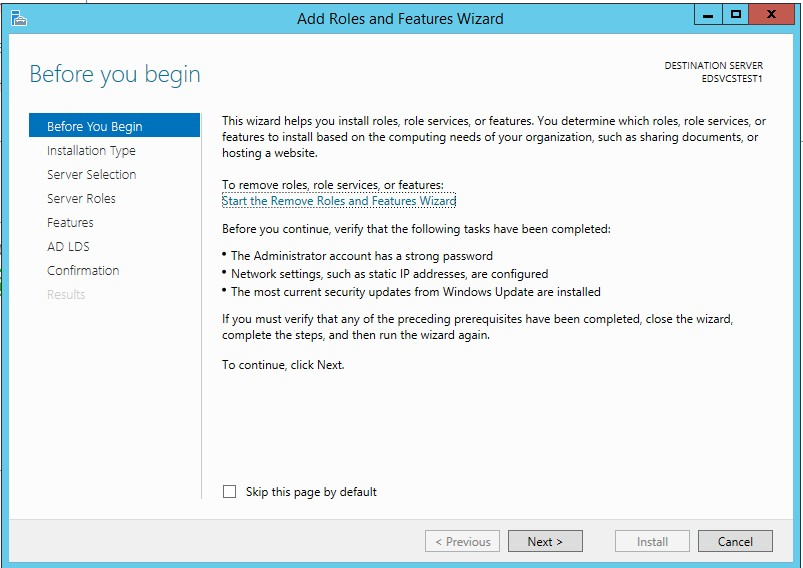

.jpeg>)

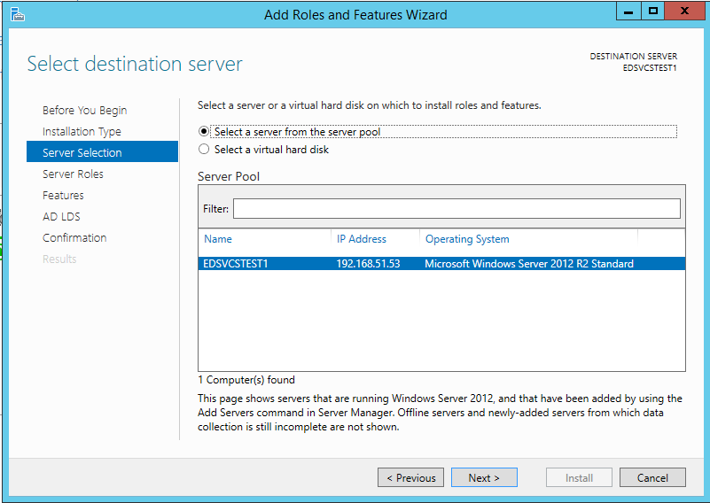

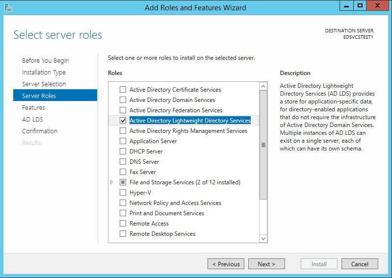

* Select AD LDS from the Roles and add the applicable features for the role.

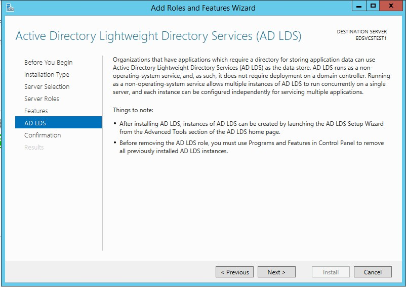

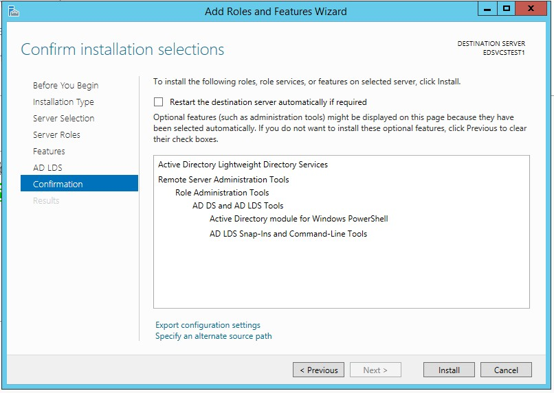

* Click Install.
* After AD LDS is installed, please follow the below steps to set up an active directory for Generate tool.
* From the Server Manager, click on AD LDS.

.jpeg>)

* Click on the “Configuration required” task and click on the Action link from the Task Window to open up the Active Directory Setup Wizard.

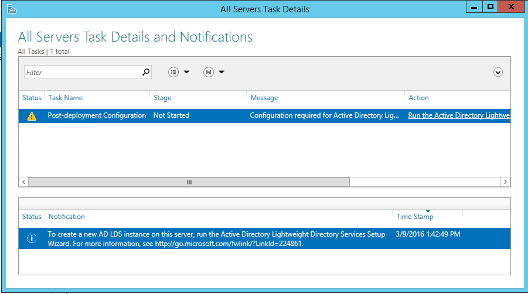 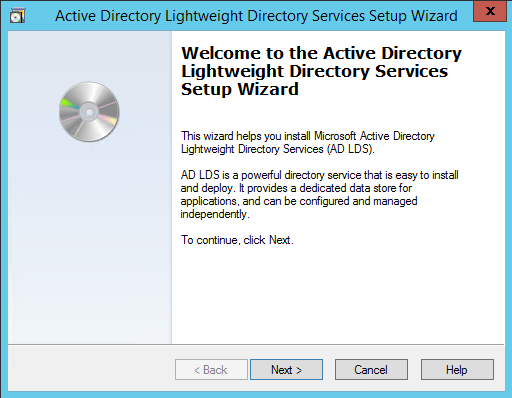

* Click Next.

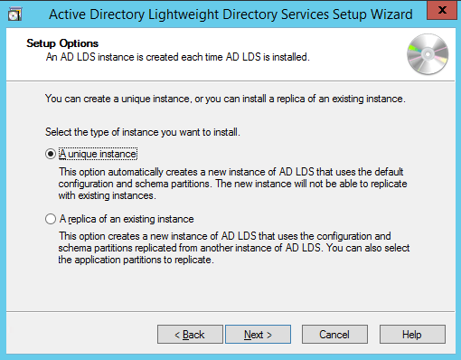

* Select “Unique Instance” option and click Next.

.png>)

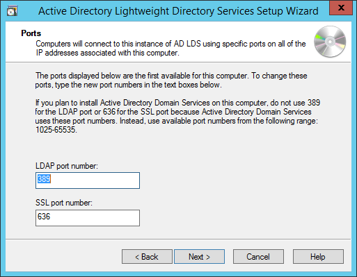

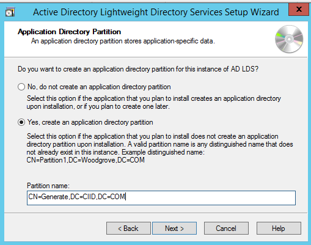

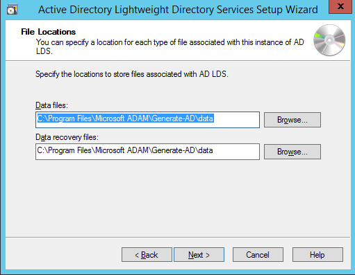

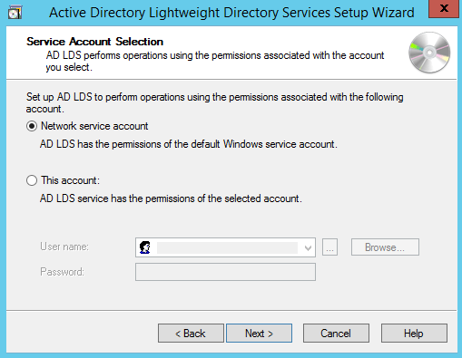

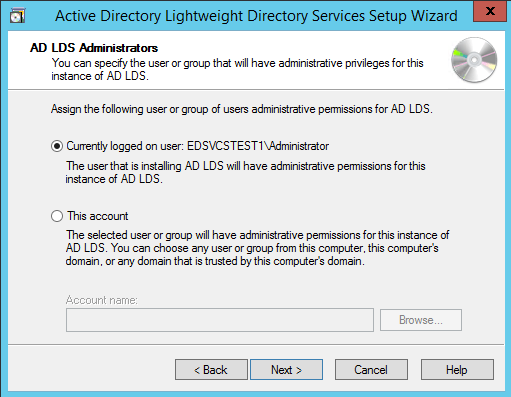

.png>)

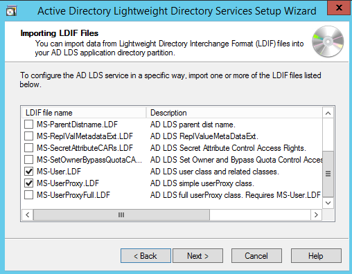

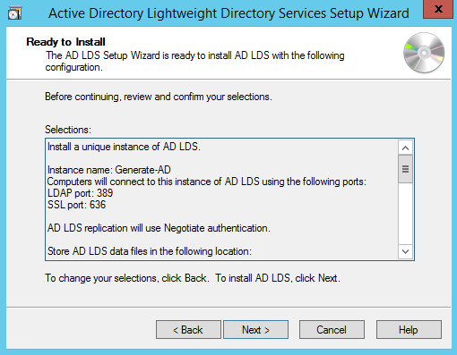

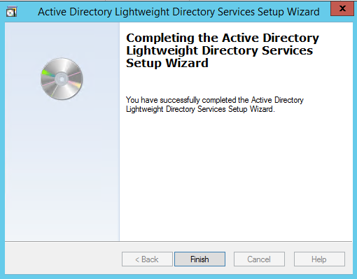

### Active Directory Service Interfaces (ADSI) Editor 

ADSI Edit is a tool used to connect to an active directory instance. It gets installed when AD LDS server role is installed.

Please use the following screenshots to connect to the AD LDS instance and set up the various roles and users for the Generate application.

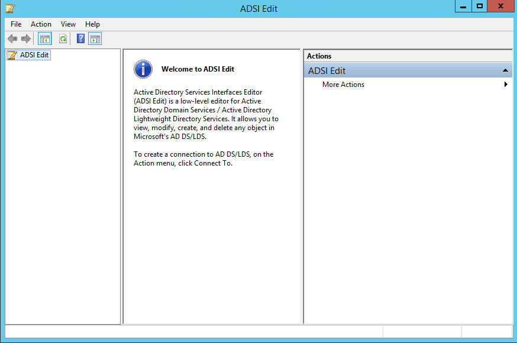

After connecting to the AD instance, a user should see 3 roles by default:&#x20;

> Admin
>
> Readers
>
> Users


A new “**Reviewers**” role will need to be added to the existing roles. The Generate tool has been configured to use Admin and Reviewers roles.


Please use the following steps to create a user for the generate tool in ADSI Edit.

1. Right click on the Generate active directory in ADSI Edit and select New object.
2. Click Next.
3. Enter the user name and click Next.
4. Click on the “More Attributes” button and set the following properties on the user object.

> distinguishedName: **CN=svuyuru, CN=Generate, DC=CIID, DC=COM**
>
> displayName : **Sumanth Vuyuru**
>
> givenName : **Sumanth**
>
> msDS-UserAccountDisabled : **False**
>
> userPrincipalName : **svuyuru**
>
> msDS-UserDontExpirePassword: **True** 🚨_Set this property if you don’t want to expire user’s password._

5. Go back and set “`ms-DS-UserPasswordNotRequired`” to **False**.

To add a user to a specific role, please add the user to member property of the role. Please use the following instructions.

1. Right click on the role and select **Properties**.
2. Go to member property and **Edit** it.
3. You should be able to add the user to that role using Distinguished Name (DN). Following is a sample DN that was added.

> CN=svuyuru,CN=Generate,DC=CIID,DC=COM
