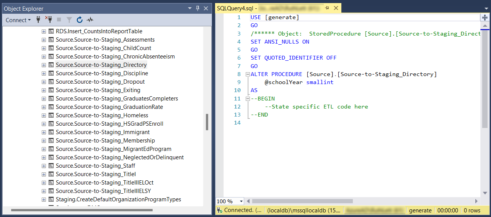

# Directory Fact Type


ease note, to take most of these steps you will need an up-to-date version of Generate installed. Please visit the [Installation](../../installation/) or [Upgrade](../../installation/upgrade/) pages for more information.


## Overview

### What are the high-level steps that you will need to take?

1. Set Up: Data Mapping & Settings
2. Migration: Building and Running ETLs
3. Validation: Verifying Data Results

### What submitted E&#x44;_&#x46;acts_ Files are included in the <mark style="color:blue;">Directory Fact Type</mark>?

The following files have been created in Generate and submitted to E&#x44;_&#x46;acts_:

* [x] 029 - Directory
* [x] 039 - Grades Offered
* [x] 129: CCD School
* [x] 130: ESEA Status\*
* [x] 131: LEA End of School Year Status\*
* [x] 163: Discipline Data
* [x] 170: LEA Subgrant Status
* [x] 190 - Charter School Authorizer Directory
* [x] 223: Title I School Status\*


\*At least one state was previously able to successfully populate report data in generate for these files. However, incomplete metadata prevented the Generate UI from producing the submission files, so they were created directly from the report tables instead.



```sql
--What EDFacts Files are included in the Directory Fact Type?
SELECT          agrft.FactTypeId 
               ,agrft.GenerateReportId
               ,rdft.FactTypeCode
               ,rdft.FactTypeDescription
               ,agr.ReportCode
               ,agr.ReportName
FROM            App.GenerateReport_FactType AS agrft
LEFT JOIN       RDS.DimFactTypes            AS rdft
                    ON rdft.DimFactTypeId = agrft.FactTypeId
LEFT JOIN       App.GenerateReports         AS agr
                    ON agr.GenerateReportId = agrft.GenerateReportId    
WHERE           rdft.FactTypeCode = 'directory'
                AND LEN(agr.ReportCode) = 4 -- only return those with report code    with a EDFacts format
ORDER BY        agrft.FactTypeId, agr.ReportCode
```


### What E&#x44;_&#x46;acts_ Files in the <mark style="color:blue;">Directory Fact Type</mark> are available for pilot opportunity?

The following files are in pilot status or are available for piloting in Generate:

* [ ] 035: Federal Programs
* [ ] 193: Title I Allocations
* [ ] 196: Management Organization for Charter Schools Roster
* [ ] 197: Crosswalk of Charter Schools to Management Organizations
* [ ] 198: Charter Contracts
* [ ] 205: Progress Achieving English Language Proficiency Indicator Status
* [ ] 206: School Support and Improvement
* [ ] 207: State Appropriations for Charter Schools

***

## 1. Set Up: Data Mappings & Settings

### Data Mappings

#### ETL Documentation Templates

The Generate ETL Documentation Templates give a detailed breakdown of all data elements needed for each Fact Type and show how data are transformed through each stage of the data migration. After completing the CEDS alignment process these templates can be used to document data transformation notes and option set mappings. They also contain a description of the CEDS data elements needed and what they are called throughout the Generate database. The ETL Templates documentation has a detailed instruction tab to help you know how to utilize this tool effectively. If you need clarification, please reach out to your CIID TA provider.


You can find the Directory ETL Documentation Template.xlsx on the ETL Documentation Template page.


#### Generate Metadata

The Generate metadata tables can be queried to determine which Staging tables need to be populated for a Fact Type.The following script will return the needed staging table, and columns for Directory:


```sql
-- How do I know what data needs to be mapped for this Fact Type?

-- Get table list of report codes, tables, and fields by fact type.

SELECT DISTINCT FactTypeCode, ReportCode, StagingTableName, StagingcolumnName
FROM app.vwStagingRelationships
WHERE FactTypeCode = 'directory'
ORDER BY FactTypeCode, ReportCode, StagingTableName, StagingcolumnName
```


### Settings

#### Toggle Settings

The Generate Toggle tables store information from the EDFacts Metadata and Process System (EMAPS) survey that impacts the business logic used to ETL the data for EDFacts reporting. It is important to make sure these questions are completed before data is migrated and that they match what was entered in EMAPS. These items can be updated on the Toggle page(s) in the Generate web application. The Toggle page is largely organized by Fact Type, though there may be cases where a setting from a different Fact Type or section may be required. We recommend updating all Toggle settings annually after you complete your EMAPS survey. Instructions for how to find and update the Toggle page are available in the Toggle documentation.

#### Source System Reference Data Settings

Source System Reference Data is used in the Staging to RDS Migration to determine how source system option set values map to CEDS option set values. This table needs to be updated with the complete set of values for all categorical fields by school year.To find the Source System Reference Data needed for each Fact Type, you can query the system by running the following script by FactTypeCode and ReportCode.You can also filter the Source System Reference Data table by FactTypeCode and ReportCode as shown below.


```sql
SELECT DISTINCT FactTypeCode, ReportCode, StagingTableName, StagingcolumnName, SSRDRefTableName, SSRDTableFilter 
FROM app.vwStagingRelationships
WHERE FactTypeCode = 'directory' and ReportCode = 'c029'
ORDER BY FactTypeCode, ReportCode, StagingTableName, StagingcolumnName
```


#### Source System Reference Tables Directory Filters

In some instances, the CEDS reference table needs to be further qualified to determine what level or type of data is being referenced by the Table Filter field. For example, the fallowing fields will need to be mapped using the value in the SSRD table using these filters. For further information please review [Source System Reference Data](https://app.gitbook.com/o/54A84G98mRVbG3AeyXRJ/s/rRyeWMyPKDUxlv4sroOL/developer-guides/generate-utilities/source-system-reference-data-mapping-utility/source-system-reference-data).

\
Directory Reports ('C029', 'C035', 'C039', 'C129', 'C130', 'C131', 'C163', 'C170', 'C190', 'C193', 'C196', 'C197', 'C198', 'C205', 'C206', 'C207', 'C223') have filters:

* 000100 Used for Grade Level
* 000174 Used for LEA Operational Status
* 000533 Used for School Operational Status
* 001156 Used for Organization Type

\
[Source System Reference Data Mapping Utility](https://app.gitbook.com/o/54A84G98mRVbG3AeyXRJ/s/rRyeWMyPKDUxlv4sroOL/developer-guides/generate-utilities/source-system-reference-data-mapping-utility) can be used to determine which option-set value mappings are needed for a Fact Type and which have been mapped. Note that new installations of Generate will come with both the InputCode and OutputCode fields loaded and you will need to review and update any values in the InputCode field to match your source data.


```sql
exec [Utilities].[Check_SourceSystemReferenceData_Mapping] 'directory', '2024', 0 -- This will show all mappings for the Directory Fact Type for School Year 2023-24
```


***

## 2. Staging

### Migration: Building & Running ETLs

#### Building the ETL Code:

The Generate database has a stored procedure for each Fact Type which is empty in the default load of the Generate database and serves as a placeholder. Since this Stored Procedure ETLs data from the education agency's source system(s) into the Generate Staging environment, the ETL code will be customized to your education agency's context. For Directory, this Stored Procedure is called `[Source].[Source-to-Staging_Directory]`.

The tools from the Set Up phase (ETL Checklist and Generate metadata) are used to guide writing the ETL Code in this Stored Procedure. Additionally, ETL code written previously to perform this work in the education agency's source system(s) can also be a useful resource at this step, particularly for ensuring critical data handling and business rules from the source system are retained in the Generate Source to Staging ETL.

<figure><figcaption><p>Screenshot of the Generate database structure in SQL Server Management Studio, showing a stored procedure placeholder for the "Source-to-Staging_Directory" Fact Type.</p></figcaption></figure>

#### Running the ETL



**Migrating Source to Staging**    &#x20;

Migrating Source to StagingThe Source to Staging code can be run from SQL Server Management Studio (SSMS) by passing in the current school year as a parameter. Generate uses the end school year. For example, 2023-24 would be specified as '2024'.

```sql
exec [Source].[Source-to-Staging_Directory] 2024
```



**Migrating Source to Staging (Generate User Interface)**

This ETL can also be run from the Generate user interface.


[data-migration.md](../data-migration.md)




### Validation: Verifying Data Results

#### Staging Validation

Once data has been migrated to the Staging tables there are two Generate tools that can be used to validate the data.

1. **Staging Validation Utility**
2. **Staging Table Debug View**

#### Staging Validation Utility

Generate has a [Staging Validation Process](https://app.gitbook.com/o/54A84G98mRVbG3AeyXRJ/s/rRyeWMyPKDUxlv4sroOL/developer-guides/generate-utilities/staging-validation) which can be called at the Fact Type or E&#x44;_&#x46;acts_ file level.&#x20;


The following is an example code snippet of how to call these Stored Procedures by the Directory Fact Type.


```sql
exec [Staging].[StagingValidation_Execute] 2024,'directory'
exec [Staging].[StagingValidation_GetResults] 2024,'directory'
```

#### Staging Table Debug View Process

To aid validation we developed Staging Table Debug views that join together the Staging data for a Fact Type in a standard format that can be used for Generate testing. You can utilize these views in researching specific subsets of data or specific student data. These views can be found in the debug schema and will automatically be filtered by the school year(s) selected in the Generate web application. Opening the view in SSMS will provide you with a variety of filtering options to modify the query as needed during testing. Detailed instructions on how to utilize this process to debug Staging table data can be found in the [Staging Table Validation Process](https://app.gitbook.com/o/54A84G98mRVbG3AeyXRJ/s/rRyeWMyPKDUxlv4sroOL/developer-guides/generate-utilities/staging-validation/staging-table-validation-process).&#x20;


The following is an example code snippet of how to select the Directory Staging Table Debug views:


```sql
select * from [debug].[vwDirectoryLEA_StagingTable]
select * from [debug].[vwDirectorySCH_StagingTable]
```

***

## 3. CEDS Data Warehouse

### Migration: Running ETLs (manually)

To migrate data from Staging to the CEDS Data Warehouse you will need to call the \[App].\[Wrapper\_Migrate\_Directory\_to\_RDS] Stored Procedure. This wrapper will call several Stored Procedures to migrate data to the dimension and fact tables in the CEDS Data Warehouse as well as log this activity in the App.DataMigrationHistories table. This process will also create debug tables that contain the information that is utilized in the counts and can be used in the validation process.



To migrate data from Staging to the CEDS Data Warehouse you will need to call the **`[App].[Wrapper_Migrate_Directory_to_RDS]`** Stored Procedure. This wrapper will call several Stored Procedures to migrate data to the dimension and fact tables in the CEDS Data Warehouse as well as log this activity in the `App.DataMigrationHistories` table. This process will also create debug tables that contain the information that is utilized in the counts and can be used in the validation process.


```sql
-- You will need to make sure the year is set to the school year you are migrating data. this script lets you check and then update if needed.

--Set school year for the RDS migrations (if necessary)    
    --check if the correct SY is already selected
     SELECT sy.SchoolYear, dm.* 
     FROM rds.DimSchoolYearDataMigrationTypes dm
     INNER join rds.dimschoolyears sy
     ON dm.dimschoolyearid = sy.dimschoolyearid
     WHERE IsSelected = 1
 
--IF THE ABOVE QUERY DOESN'T RETURN THE SY YOU NEED, RUN THE NEXT 2 QUERIES
 
  --reset, then set the appropriate year for this migration
     UPDATE rds.DimSchoolYearDataMigrationTypes
     SET IsSelected = 0
 -- Update to the year you are migrating
     UPDATE rds.DimSchoolYearDataMigrationTypes
     SET IsSelected = 1
     FROM rds.DimSchoolYearDataMigrationTypes sydmt
     JOIN rds.DimSchoolYears sy
     ON sydmt.DimSchoolYearId = sy.DimSchoolYearId
     WHERE SchoolYear = 2024
     
-- call the wrapper script to migrate the Fact Type data

exec [app].[Wrapper_Migrate_Directory_to_RDS]
```




### Migration: Running ETLs (Generate User Interface)

This Migration process can also be run from the Generate user interface.


[data-migration.md](../data-migration.md)




### Validation: Verifying Data Results

Once data has been migrated to the Staging tables the Fact Table Debug View can be used to validate the data.

#### Fact Table Debug Views

The Directory Fact Table Debug views join together the CEDS Data Warehouse data for this Fact Type in a standard format that is used for Generate testing. These views will automatically be filtered by the school year(s) selected in the Generate web application and stored in the `RDS.DimSchoolYearDataMigrationTypes` table. However, opening the view in SSMS will provide you with a variety of filtering options to modify this query as needed during testing.&#x20;

Detailed instructions on how to utilize this process to debug Fact Table data can be found in the [Fact Type Table Validation Process](../../generate-utilities/fact-type-table-validation-process.md) guide.


The following is an example code snippet of how to select the Directory Staging Table Debug views:


```sql
select * from [generate].[debug].[vwDirectorySEA_FactTable]
select * from [generate].[debug].[vwDirectoryLEA_FactTable]
select * from [generate].[debug].[vwDirectorySCH_FactTable]

select * from [generate].[debug].[vwDirectoryLiteLEA_FactTable]
select * from [generate].[debug].[vwDirectoryLiteSCH_FactTable]
```

***

## 4. Report Tables

### Migration: Running ETLs

#### Database Settings

To migrate data from the CEDS Data Warehouse to the Report Tables in SSMS you will need to update some settings in the database and call the `[rds].[create_reports]` Stored Procedure.


```sql
-- A. Make sure the Report Data Migration Type is selected
    DECLARE @SchoolYearId int = (SELECT DimSchoolYearId FROM RDS.DimSchoolYears WHERE SchoolYear = 2024)
    UPDATE RDS.DimSchoolYearDataMigrationTypes SET IsSelected = 0
    UPDATE RDS.DimSchoolYearDataMigrationTypes 
    SET IsSelected = 1
    WHERE DimSchoolYearId = @SchoolYearId and DataMigrationTypeId = 3 -- Reports

-- B. Lock the reports to be run
    UPDATE App.GenerateReports set IsLocked = 0
    UPDATE App.GenerateReports
    SET IsLocked = 1
    WHERE ReportCode IN ('C029','C035','C039','C129','C130','C131','C163','C170','C190','C193','C196','C197','C198','C205','C206','C207','C223')

-- C. Empty the reports table for the specific reports    
    EXEC [rds].[Empty_Reports] @FactTypeCode = 'directory'

-- D. Perform the reports migration
    EXEC [rds].[create_reports] 'directory',0
```



The [Clean Up Debug Tables](../../generate-utilities/cleanup-debug-tables.md) utility helps remove unneeded debug tables created during data migration. However, since Directory files do not contain aggregate student counts, they do not generate the same debug tables as other Fact Types. As a result, no cleanup is needed for Directory Fact Type files.


### Validation: Verifying Data Results

#### File Comparison Utility

The [File Comparison Utility](https://app.gitbook.com/o/54A84G98mRVbG3AeyXRJ/s/rRyeWMyPKDUxlv4sroOL/developer-guides/generate-utilities/file-comparison) allows you to compare EDFacts submission files to data stored in the Report Tables in the Generate database. Instructions on how to use the `Utilities.Compare_DIRECTORY` Stored Procedure are available here. Typically, this step is performed in the first year of reporting a file through Generate to compare it to previous submission files produced by the legacy system


```sql
-- Once you have followed the steps in the File Comparison Utility, you can run this to find the results.
exec Utilities.Compare_DIRECTORY
@DatabaseName = 'Generate', -- Your database name 
@SchemaName = 'XX', -- Your schema name 
@SubmissionYear = 2023, -- The report year
@ReportCode = 'C029', -- EdFacts File Number – c029, c035, c039, c129, c130, c131, c163, c170, c190, c193, c196, c197, c198, c205, c206, c207, c223
@ReportLevel = 'LEA', -- 'SEA', 'LEA'
@LegacyTableName = 'Generate.XX.C029_LEA_2023_Legacy', -- Legacy table
@ShowSQL = 0
```


If you need further assistance validating your data or have data mismatches that you cannot resolve, please reach out to your TA provider for assistance.

***

## Additional Utilities

### IDEA Part B Data Review Checklist

This [IDEA Part B Data Review](https://ciidta.communities.ed.gov/#communities/pdc/documents/21449) Checklist helps state teams review and validate IDEA EDFacts files. It includes a tab for each IDEA EDFacts file specification, and lists considerations and types of validations to ensure accurate and complete data file submissions. Please review the Instruction tab and look for the associated report codes for the Directory Fact Type.

### Staging Table Snapshot Utility

Generate allows states to create a backup or “snapshot” of staging tables. This is an optional utility that can be executed as needed or embedded into the State’s ETL workflow logic. The [Staging Table Snapshot Utility](https://app.gitbook.com/o/54A84G98mRVbG3AeyXRJ/s/rRyeWMyPKDUxlv4sroOL/developer-guides/generate-utilities/staging-table-snapshot) provides a method to create a backup copy of staging tables for future use and reference after an ETL has populated Generate’s staging tables. This helps to ensure consistency across all EDFacts reports for a given year and developers can preserve data in staging tables across ETL executions. This is best utilized after you have confirmed the Fact Type has successfully produced an accurate EDFacts file.
