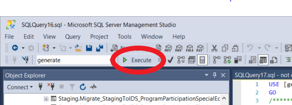
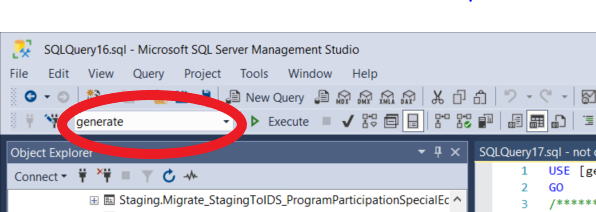

# Hot Fix - 4/13/2023

## Impacted

* [x] SEAs Implementing Generate

## **Issue**

Incorrect state data populated into the _`RDS.DimSeas`_&#x74;able. This impacts the State Code in the filename when an E&#x44;_&#x46;acts_ submission file is created.&#x20;

## State Requirement Check: How-to?&#x20;


**This fix will not be required in every state**. However, it can be applied without issue whether it is required or not.&#x20;


1. Open any State ETL code that moves the data from the state source into the staging tables.
2. Look for the section of code that populates the table _`Staging.StateDetail`_ and the column _`SeaStateIdentifier`_.
   1. If that column is being populated with the State ANSI Code, then this update is not necessary.
   2. If that column is being populated with anything other than the State ANSI Code, you will need to apply the attached hot fix, then re-run your staging-to-RDS data migrations for any 2023 SY files.

## Instructions for Applying the Hot Fix

In order to apply the hotfix changes, follow the instructions below.


The following instructions are for SSMS (SQL Server Management Studio).  If you use a different tool for SQL coding find the appropriate options to do the same thing.


1. Open SSMS
2. Connect to your Generate database (if you have more than one, Production and Test as an example, start with Test or your lesser controlled environment, before applying to Production)
3. In SSMS, open the attached file.
4. Hit **F5** or click **EXECUTE** from the menu ribbon to apply the changes in that file

<figure><figcaption>
Click Execute from the menu ribbon
</figcaption></figure>

5. **OPTIONAL:** If you need to apply this change to another database, click the database dropdown from the ribbon and change it to the appropriate database, then hit **F5** or click **EXECUTE** from the ribbon.  You can repeat this process as many times as needed to apply the change to your databases.

<figure><figcaption>
Click the database dropdown to change teh database
</figcaption></figure>


If you are currently receiving CIID Technical Assistance, your CIID Developer can assist with any questions regarding this hot fix or please reply reach out to CIID at [ciidta@aemcorp.com](mailto:ciidta@aemcorp.com)

