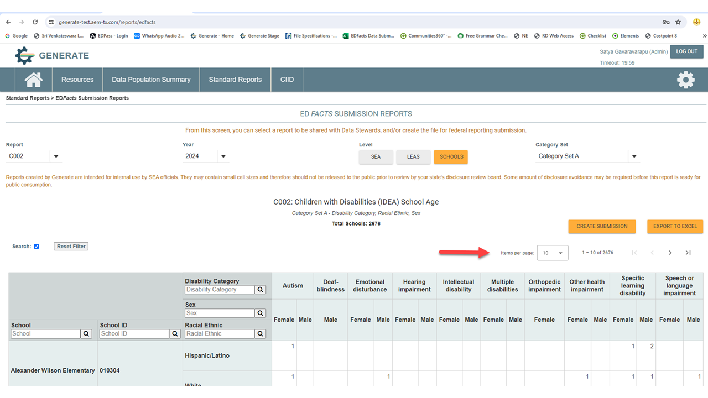

# Release Notes 11.4

## Release Overview

Generate version 11.4 is focused on the Child Count files, file specifications FS002 and FS089 due for submission to EDPass July 31, 2024.

### Release Highlights

#### Updated Generate Staging Validation Process

Generate Version 11.4 introduces a new and improved Staging Validation process. This new validation process includes an expanded library of validation rules and makes it easier to create and manage custom validation rules. Full documentation for the new process can be found here.


[staging-validation](../developer-guides/generate-utilities/staging-validation/)


### Important Updates

#### New Features

Paging Enhancement: Implemented paging functionality to enhance the loading speed of larger result sets in the user interface (UI), ensuring smoother navigation and improved user experience.

<figure><figcaption>
Paging feature can be found above the table on the right.
</figcaption></figure>

Expanded Search Functionality:

* Case Insensitivity: Search feature now supports case-insensitive queries.
* Partial Text Search: Users can now search using partial text, enabling them to locate data even with incomplete input.
* Search by Header Value: Added support for searching based on header values.
* Search by Permitted Value: Enhanced search functionality to include searching by the underlying permitted value.

<figure><figcaption></figcaption></figure>

#### Performance Improvements

Enhanced Report Display Performance: Optimized the performance of displaying results for all reports in the UI, resulting in faster loading times and smoother navigation within the application.\
Improved Organization Level Report Performance: Enhanced the performance when switching between Organization Level reports, ensuring swift and efficient access to relevant data.\

### Generate Enhancements

The following EDFacts reports were updated in this release.

#### Type of Impact:

* Data – the changes will improve data quality and completeness.
* User Interface – the changes impact the Generate User Interface and/or migration process.
* Source to Staging ETL – the changes may require modifications to the SEA’s Source to Staging ETL
* Performance – the changes improve the performance of the application.
* Migration – the changes impact a data migration process.
* Submission Files – the changes may impact submission file(s)
* Database – changes to the Generate database structure.

<table data-full-width="false"><thead><tr><th>Report Name</th><th>Report</th><th>Approved Change</th><th>Ticket #</th><th>Impact<select><option value="pDXKT44Khtbl" label="Data" color="blue"></option><option value="wl9wseks7b5l" label="User Interface" color="blue"></option><option value="8SKOrBVBWMBO" label="Performance" color="blue"></option></select></th></tr></thead><tbody><tr><td>Free and Reduced Price Lunch</td><td>FS033</td><td>Migration code and web code have been modified to accurately populate Permitted Values for Direct Certification students in both the UI and submission files.</td><td>CIID-4871</td><td>User Interface</td></tr><tr><td>Child Count</td><td>
FS002

FS089
</td><td>Enhanced the Child Count migration logic to handle situations where an administrative organization that handles IEP administration for multiple districts is the responsible organization that needs to be reported in the counts and zero counts.</td><td>CIID-5818 </td><td>Data</td></tr><tr><td>Free and Reduced Price Lunch</td><td>FS033</td><td>Enhanced the Debug table population for FS033 to capture the Data Group (DIRECTCERT, LUNCHFREERED) along with the Student information.</td><td>CIID-5847</td><td>Data</td></tr><tr><td>
Dropouts

Free and Reduced Price Lunch

Graduates/Completers

Immigrant

Membership

Staff FTE

Discipline

Homeless Students Enrolled

EL Enrolled

Migratory Data
</td><td>
FS032

FS033

FS040

FS045

FS052

FS059

FS086

FS118

FS141

FS165
</td><td>Added additional staging validations for more files including file specifications 032, 033, 040, 045, 052, 059, 086, 118, 141, and 165.</td><td>CIID-5947</td><td>Data</td></tr><tr><td>CCD School</td><td>FS129</td><td>Updated the Directory ETL checklist to include file specification 129.</td><td>CIID-6474</td><td>Data</td></tr><tr><td>Exciting</td><td>FS009</td><td>Added a Staging validation for students who exit with the value “Reached Maximum Age” but are younger than the Maximum Age for Services defined in Toggle.</td><td>CIID-6482</td><td>Data</td></tr><tr><td>Assessments Discipline Staff</td><td>
FS175

FS178

FS179

FS185

FS188

FS189

 FS005

FS006

FS007

FS086

FS088

FS143

FS144

 FS070

FS099

FS112  
</td><td>Within the Generate infrastructure and migration code we've added three new Fact Types for Assessments, Discipline, and Staff. They were previously processed using the ‘submission’ Fact Type. Now they each have a defined Fact Type that aligns with all the other files.</td><td>CIID-6490</td><td>Data</td></tr><tr><td>Directory</td><td>FS029</td><td>Corrected the population of the Reconstituted Status for Schools to be in all-caps in the UI and in the submission file.</td><td>CIID-6522</td><td>User Interface</td></tr><tr><td>Free and Reduced Price Lunch Membership</td><td>FS033 FS052</td><td>Improved how Membership migration handles <code>GradeLevel</code> values in <code>Staging.K12Enrollment</code>.</td><td>CIID-6610</td><td>Data</td></tr><tr><td>Grades Offered</td><td>FS039</td><td>Updated the report logic for 039 - Grades Offered to exclude Reportable Programs from the counts.</td><td>CIID-6655</td><td>Data</td></tr><tr><td>Child Count  Membership Exciting</td><td>
FS002

FS089 FS052 FS009
</td><td>We added a new table that connects the Generate Fact Type to the Generate Report ID which will allow us to remove some hard-coded values and automate updates in the future.</td><td>CIID-6524</td><td>Performance</td></tr></tbody></table>

### Upgrade Procedure

No changes have been made to the Generate upgrade procedure for this release. Follow the standard Generate upgrade process to install version 11.4.

### Compatible Systems

Generate was tested on the following operating systems and browsers:

* Windows 10 Pro
* Google Chrome, Version 68 0.3440.106 (Official Build) (64-bit) and Firefox Quantum 61.01 (64 bit)

***

## Office Hour


