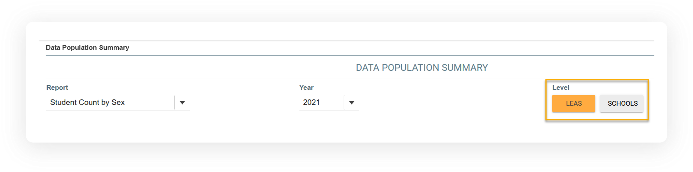

# Producing Reports

## Report Options 

You can filter reports by various options, such as **Report**, **Year**, and **Level**. You can filter the reports by local education agencies (LEAs) or schools, and you can export the reports to share with others. Each online report can be sorted in ascending or descending order by clicking on a column header. The report will automatically update and display data as the various query options are selected.

The following sections describe how to run and use each report in the Data Population Summary.

### **Level**

You can run the Data Population Summary reports by SEA, LEA, or school level as shown below:

<figure><figcaption></figcaption></figure>

#### To run a report by LEA level:

1. Click on the **LEAS** button.


* The page will display an aggregated report of student counts by LEAs. This report also includes a statewide total.
* LEAs will be listed in alphabetical order by name.&#x20;


#### To run a report by School level:

1. Click on the **SCHOOLS** button.


* The page will display an aggregated report of student counts by school. This report also includes a statewide total.
* Schools are listed in alphabetical order by name.



There is no correlation between LEA and School selection. Selecting SCHOOLS includes all schools in the ODS.


### **Year**

The Data Population Summary Home page defaults to the most recent year. The dropdown menu is based on data in the DimDates database table. The data within that table drive the years that are displayed on the dropdown list.

#### To select a different year:

1. Click on the dropdown arrow to display a list of years available for reporting.
2. Click on a year to select it.

### **Filter**

Each report has a filter field that lets you view the data for a certain LEA or school. To filter for a specific LEA or school:

1. Click inside the Filter field.
2. Enter at least two characters in the field.
3. The system will return the data based on your selection.
4. To clear the filter field, delete the entries.

<figure><figcaption></figcaption></figure>
